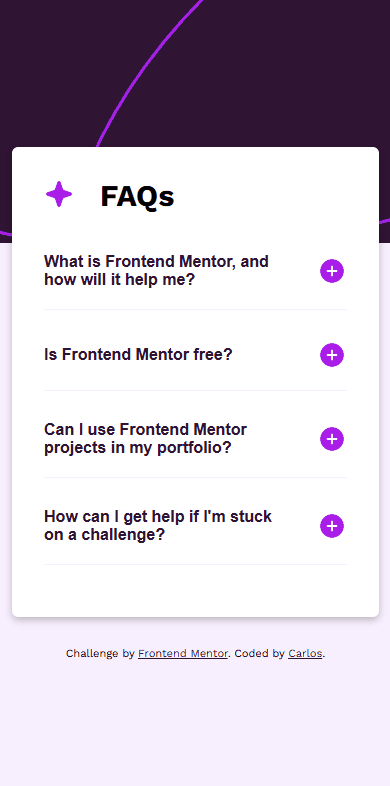
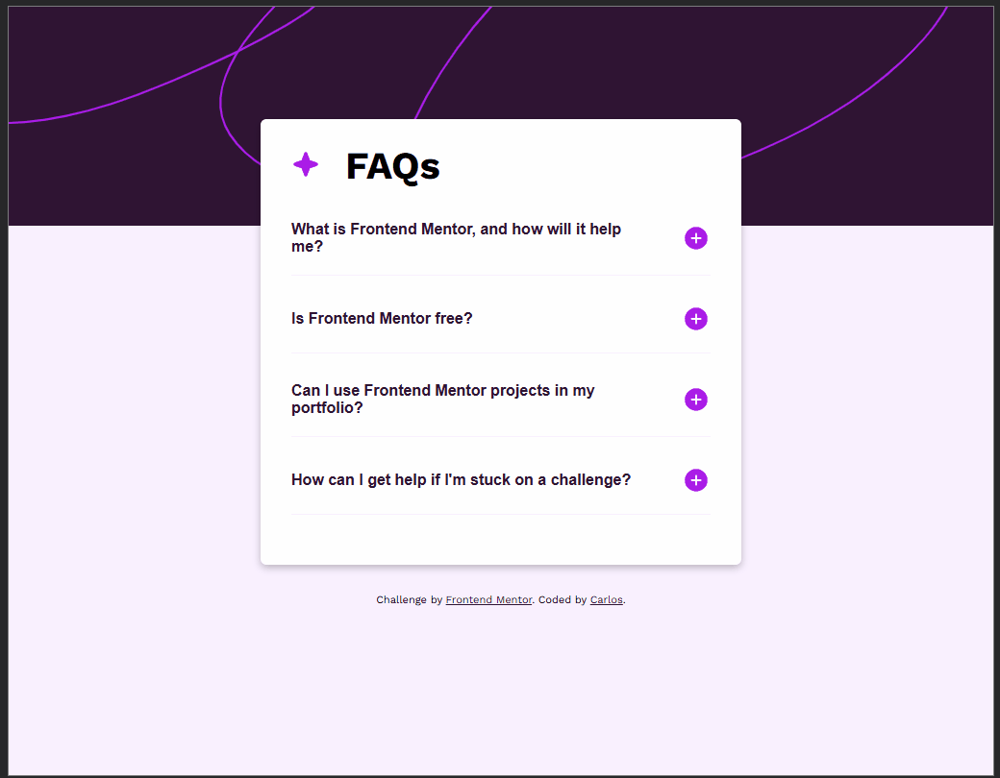

# FAQ Accordion - Frontend Mentor Challenge
Este é um projeto desenvolvido como parte de um desafio do <a href="https://www.frontendmentor.io/challenges/faq-accordion-wyfFdeBwBz" target="_blank" rel="noopener noreferrer">FAQ Accordion</a> do Frontend Mentor, com o objetivo de criar um componente de FAQ funcional e responsivo, utilizando HTML, CSS e JavaScript puro.

## 💡 Descrição
O componente exibe uma lista de perguntas frequentes (FAQs). Ao clicar em uma pergunta:
- A resposta correspondente é exibida
- Qualquer outra resposta aberta anteriormente é automaticamente fechada
- O ícone de "+" muda para "-" ao expandir e vice-versa

## 📸 Screenshot
| Versão Mobile | Versão Desktop |
|  |  |

## 🛠️ Tecnologias utilizadas
- HTML5
- CSS3
- JavaScript 
- Google Fonte: (Work Sans)

## 🔍 Funcionalidades
- Abertura de apenas uma resposta por vez
- Animações suaves com `max-height` e `@keyframes`
- Ícones dinâmicos para indicar o estado da pergunta
- Layout responsivo para mobile e desktop

## 🎯 Aprendizados
Durante o desenvolvimento, foram aplicadas boas práticas de:
- Estrutura semântica de HTML
- Responsividade com media queries
- Manipulação de DOM com JavaScript puro
- Acessibilidade com aria-expanded

## 🔗 Links
- URL da solução: <a href="https://github.com/slayer-br/faq-accordion" target="_blank" rel="noopener noreferrer">Testimonials Grid Section</a>
- Site ao vivo: <a href="https://github.com/slayer-br/faq-accordion" target="_blank" rel="noopener noreferrer">Testimonials Grid Section</a>

## 👨‍💻 Autor
- GitHub - <a href="https://github.com/slayer-br" target="_blank" rel="noopener noreferrer">@slayer-br</a>
- Frontend Mentor - <a href="https://www.frontendmentor.io/profile/slayer-br" target="_blank" rel="noopener noreferrer">@slayer-br</a>

## 📝 Licença
Este projeto está sob a licença [MIT](LICENSE), sinta-se livre para usar e modificar.